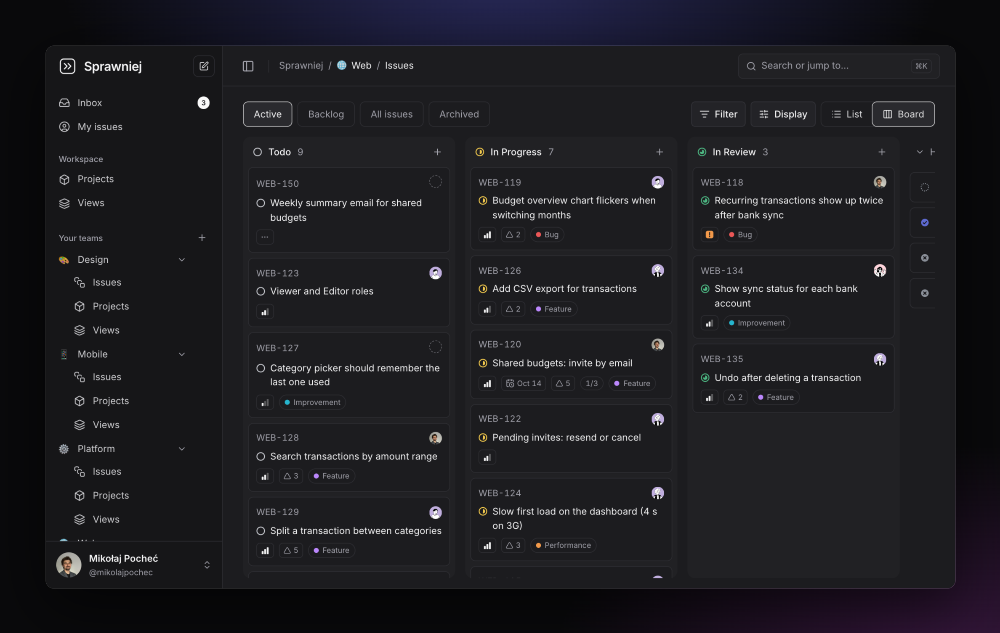

# Sprawniej

Plan and track your team's work: issues, projects and views, kept in a GitHub repo you own.

**Open it: [mikolajpochec.github.io/sprawniej](https://mikolajpochec.github.io/sprawniej/)**



- **Issues** with statuses and priorities, rich descriptions, sub-issues and comments
- **List and board**, with drag-n-drop in both
- **Teams**, each with its own issues, projects and views
- **Views** with emojis: saved filters anyone on the team can open
- **Inbox** for assignments, mentions and comments
- **Import from Linear**
- **Saves by itself.** No Save button. Works offline and catches up when you're back.
- **No server.** A static page on GitHub Pages; your workspace is a GitHub repo of small, readable files.
  Sign in with your GitHub account.

## For teammates

Open the join link you were sent and follow the steps. The [user guide](docs/user-guide.md) explains the rest.

## For developers

```sh
bun install
bun dev            # http://localhost:5173
bun test           # logic tests
bun run build      # dist/, deployed to GitHub Pages from main
                   # VITE_PUBLIC_URL=https://… bun run build  to make join links use your own domain
```

Start with [CLAUDE.md](CLAUDE.md) (working rules) and [docs/architecture.md](docs/architecture.md).
